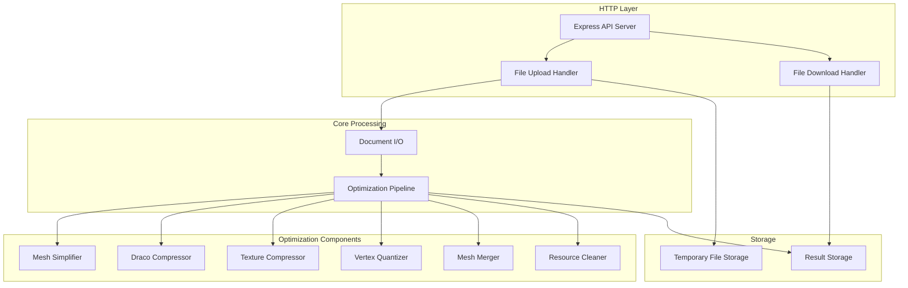
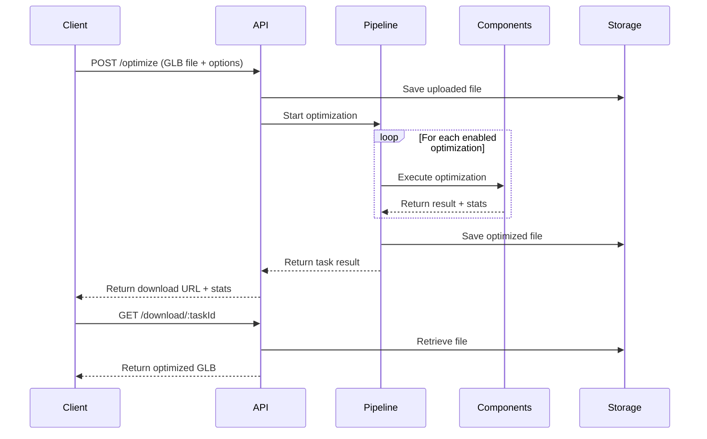

# Design Document: GLB Optimizer Server

## Overview

GLB Optimizer Server 是一个基于 Node.js 的本地部署服务，提供 RESTful API 用于优化 3D GLB 模型文件。服务器采用模块化架构，将各种优化能力封装为独立组件，通过优化流水线进行协调。

### 核心设计原则

1. **模块化**: 每种优化能力独立封装，便于维护和扩展
2. **可组合**: 支持任意组合的优化选项
3. **开源合规**: 所有依赖均为免费开源库
4. **跨平台兼容**: 优化结果兼容 Unity 和 Web 端

### 技术栈

- **运行时**: Node.js
- **Web 框架**: Express + swagger-ui-express + swagger-jsdoc
- **API 文档**: OpenAPI 3.0 (Swagger)
- **核心库**: @gltf-transform/core, @gltf-transform/extensions, @gltf-transform/functions
- **网格减面**: meshoptimizer (通过 @gltf-transform/functions)
- **几何压缩**: draco3d (通过 @gltf-transform/extensions)
- **纹理压缩**: sharp + @gltf-transform/functions (KTX2/Basis Universal)
- **可选缓存**: Redis (ioredis)
- **可选云存储**: 腾讯云 COS (cos-nodejs-sdk-v5)

## Architecture



### 请求处理流程



## Components and Interfaces

### 1. API Server (Express + Swagger)

```typescript
// API 路由定义
interface APIRoutes {
  // 文件上传并优化
  'POST /api/optimize': {
    body: FormData; // file + options JSON
    response: OptimizationResult;
  };
  
  // 下载优化后的文件
  'GET /api/download/:taskId': {
    params: { taskId: string };
    response: Buffer; // GLB binary
  };
  
  // 获取任务状态
  'GET /api/status/:taskId': {
    params: { taskId: string };
    response: TaskStatus;
  };
  
  // Swagger UI
  'GET /api-docs': {
    response: 'Swagger UI HTML';
  };
  
  // OpenAPI JSON
  'GET /api-docs.json': {
    response: 'OpenAPI 3.0 Specification';
  };
}
```

### OpenAPI 配置

```typescript
// swagger.config.ts
const swaggerOptions = {
  definition: {
    openapi: '3.0.0',
    info: {
      title: 'GLB Optimizer Server API',
      version: '1.0.0',
      description: 'RESTful API for optimizing GLB 3D model files',
    },
    servers: [
      {
        url: 'http://localhost:3000',
        description: 'Local development server',
      },
    ],
  },
  apis: ['./src/routes/*.ts'], // JSDoc 注释所在文件
};
```

### API 端点 JSDoc 示例

```typescript
/**
 * @openapi
 * /api/optimize:
 *   post:
 *     summary: Upload and optimize a GLB file
 *     tags: [Optimization]
 *     requestBody:
 *       required: true
 *       content:
 *         multipart/form-data:
 *           schema:
 *             type: object
 *             properties:
 *               file:
 *                 type: string
 *                 format: binary
 *                 description: GLB file to optimize
 *               options:
 *                 type: string
 *                 description: JSON string of optimization options
 *     responses:
 *       200:
 *         description: Optimization successful
 *         content:
 *           application/json:
 *             schema:
 *               $ref: '#/components/schemas/OptimizationResult'
 *       400:
 *         description: Invalid file or options
 *       413:
 *         description: File too large
 */
```

### 2. Optimization Options Interface

```typescript
interface OptimizationOptions {
  // 网格减面选项
  simplify?: {
    enabled: boolean;
    targetRatio?: number;        // 0.1 - 1.0, 目标比例
    targetCount?: number;        // 目标三角形数量
    error?: number;              // 误差阈值 (0.0 - 1.0)
    lockBorder?: boolean;        // 保留边界边
  };

  // Draco 压缩选项
  draco?: {
    enabled: boolean;
    compressionLevel?: number;   // 0-10, 默认 7
    quantizePosition?: number;   // 位置量化位数
    quantizeNormal?: number;     // 法线量化位数
    quantizeTexcoord?: number;   // UV 量化位数
  };

  // 纹理压缩选项
  texture?: {
    enabled: boolean;
    mode?: 'ETC1S' | 'UASTC';   // 默认 ETC1S
    quality?: number;           // 质量参数
    slots?: string[];           // 要压缩的纹理槽位
  };

  // 向量量化选项
  quantize?: {
    enabled: boolean;
    quantizePosition?: boolean;  // 位置坐标量化
    quantizeNormal?: boolean;    // 法线量化
    quantizeTexcoord?: boolean;  // UV 量化
    quantizeColor?: boolean;     // 顶点色量化
  };

  // Mesh 合并选项
  merge?: {
    enabled: boolean;
  };

  // 资源清理选项
  clean?: {
    enabled: boolean;
    removeUnusedNodes?: boolean;
    removeUnusedMaterials?: boolean;
    removeUnusedTextures?: boolean;
  };
}
```

### 3. Optimization Result Interface

```typescript
interface OptimizationResult {
  taskId: string;
  success: boolean;
  downloadUrl: string;
  processingTime: number;       // 毫秒
  
  originalSize: number;         // 原始文件大小 (bytes)
  optimizedSize: number;        // 优化后文件大小 (bytes)
  compressionRatio: number;     // 压缩比
  
  steps: OptimizationStepResult[];
}

interface OptimizationStepResult {
  step: string;                 // 步骤名称
  success: boolean;
  duration: number;             // 耗时 (ms)
  stats: Record<string, any>;   // 步骤特定统计
  error?: string;               // 错误信息
}
```

### 4. Mesh Simplifier Component

```typescript
interface MeshSimplifier {
  /**
   * 使用 meshoptimizer 进行网格减面
   * @param document - gltf-transform Document
   * @param options - 减面选项
   * @returns 减面统计信息
   */
  simplify(
    document: Document,
    options: SimplifyOptions
  ): Promise<SimplifyStats>;
}

interface SimplifyOptions {
  targetRatio?: number;    // 目标比例 (0.1 - 1.0)
  targetCount?: number;    // 目标三角形数量
  error?: number;          // 误差阈值
  lockBorder?: boolean;    // 保留边界边
}

interface SimplifyStats {
  originalTriangles: number;
  simplifiedTriangles: number;
  reductionRatio: number;
  meshesProcessed: number;
}
```

### 5. Draco Compressor Component

```typescript
interface DracoCompressor {
  /**
   * 使用 Draco 压缩几何数据
   * @param document - gltf-transform Document
   * @param options - 压缩选项
   * @returns 压缩统计信息
   */
  compress(
    document: Document,
    options: DracoOptions
  ): Promise<DracoStats>;
}

interface DracoOptions {
  compressionLevel?: number;    // 0-10, 默认 7
  quantizePosition?: number;    // 位置量化位数
  quantizeNormal?: number;      // 法线量化位数
  quantizeTexcoord?: number;    // UV 量化位数
}

interface DracoStats {
  meshesCompressed: number;
  originalSize: number;
  compressedSize: number;
  compressionRatio: number;
}
```

### 6. Texture Compressor Component

```typescript
interface TextureCompressor {
  /**
   * 使用 Basis Universal 压缩纹理
   * @param document - gltf-transform Document
   * @param options - 压缩选项
   * @returns 压缩统计信息
   */
  compress(
    document: Document,
    options: TextureOptions
  ): Promise<TextureStats>;
}

interface TextureOptions {
  mode?: 'ETC1S' | 'UASTC';    // 编码模式
  quality?: number;            // 质量参数
  slots?: string[];            // 纹理槽位
}

interface TextureStats {
  texturesProcessed: number;
  originalSize: number;
  compressedSize: number;
  compressionRatio: number;
  details: TextureDetail[];
}

interface TextureDetail {
  name: string;
  originalFormat: string;
  originalSize: number;
  compressedSize: number;
}
```

### 7. Vertex Quantizer Component

```typescript
interface VertexQuantizer {
  /**
   * 使用 gltf-transform quantize 进行向量量化
   * @param document - gltf-transform Document
   * @param options - 量化选项
   * @returns 量化统计信息
   */
  quantize(
    document: Document,
    options: QuantizeOptions
  ): Promise<QuantizeStats>;
}

interface QuantizeOptions {
  quantizePosition?: boolean;
  quantizeNormal?: boolean;
  quantizeTexcoord?: boolean;
  quantizeColor?: boolean;
}

interface QuantizeStats {
  attributesQuantized: string[];
  originalSize: number;
  quantizedSize: number;
  reductionRatio: number;
}
```

### 8. Mesh Merger Component

```typescript
interface MeshMerger {
  /**
   * 合并使用相同材质的 mesh
   * @param document - gltf-transform Document
   * @returns 合并统计信息
   */
  merge(document: Document): Promise<MergeStats>;
}

interface MergeStats {
  originalMeshCount: number;
  mergedMeshCount: number;
  meshesReduced: number;
}
```

### 9. Resource Cleaner Component

```typescript
interface ResourceCleaner {
  /**
   * 移除未使用的资源
   * @param document - gltf-transform Document
   * @param options - 清理选项
   * @returns 清理统计信息
   */
  clean(
    document: Document,
    options: CleanOptions
  ): Promise<CleanStats>;
}

interface CleanOptions {
  removeUnusedNodes?: boolean;
  removeUnusedMaterials?: boolean;
  removeUnusedTextures?: boolean;
}

interface CleanStats {
  nodesRemoved: number;
  materialsRemoved: number;
  texturesRemoved: number;
}
```

### 10. Optimization Pipeline

```typescript
interface OptimizationPipeline {
  /**
   * 执行优化流水线
   * @param inputPath - 输入 GLB 文件路径
   * @param outputPath - 输出 GLB 文件路径
   * @param options - 优化选项
   * @returns 优化结果
   */
  execute(
    inputPath: string,
    outputPath: string,
    options: OptimizationOptions
  ): Promise<OptimizationResult>;
}

// 优化步骤执行顺序
const OPTIMIZATION_ORDER = [
  'clean',      // 1. 资源清理
  'merge',      // 2. Mesh 合并
  'simplify',   // 3. 网格减面
  'quantize',   // 4. 向量量化
  'draco',      // 5. Draco 压缩
  'texture',    // 6. 纹理压缩
] as const;
```

## Data Models

### Task Model

```typescript
interface Task {
  id: string;                    // UUID
  status: TaskStatus;
  createdAt: Date;
  completedAt?: Date;
  
  inputFile: string;             // 输入文件路径
  outputFile?: string;           // 输出文件路径
  options: OptimizationOptions;
  
  result?: OptimizationResult;
  error?: string;
}

type TaskStatus = 'pending' | 'processing' | 'completed' | 'failed';
```

### File Validation

```typescript
interface FileValidation {
  isValid: boolean;
  fileSize: number;
  mimeType: string;
  errors: string[];
}

const FILE_CONSTRAINTS = {
  maxSize: 100 * 1024 * 1024,    // 100MB
  allowedMimeTypes: ['model/gltf-binary'],
  allowedExtensions: ['.glb'],
};
```

### Error Response

```typescript
interface ErrorResponse {
  success: false;
  error: {
    code: string;
    message: string;
    details?: Record<string, any>;
  };
}

// 错误代码
const ERROR_CODES = {
  INVALID_FILE: 'INVALID_FILE',
  FILE_TOO_LARGE: 'FILE_TOO_LARGE',
  INVALID_OPTIONS: 'INVALID_OPTIONS',
  OPTIMIZATION_FAILED: 'OPTIMIZATION_FAILED',
  TASK_NOT_FOUND: 'TASK_NOT_FOUND',
  INTERNAL_ERROR: 'INTERNAL_ERROR',
} as const;
```


## Correctness Properties

*A property is a characteristic or behavior that should hold true across all valid executions of a system—essentially, a formal statement about what the system should do. Properties serve as the bridge between human-readable specifications and machine-verifiable correctness guarantees.*

### Property 1: Valid File Upload Acceptance

*For any* valid GLB file within size limits, uploading it to the server SHALL return a valid task identifier (UUID format) and the task SHALL be retrievable.

**Validates: Requirements 1.1**

### Property 2: Invalid File Rejection

*For any* invalid file (non-GLB format, corrupted binary, empty file), uploading it to the server SHALL return an error response with appropriate error code and descriptive message.

**Validates: Requirements 1.2**

### Property 3: Optimization Output Validity

*For any* valid GLB file that completes optimization successfully, the output file SHALL be a valid GLB file that can be parsed without errors.

**Validates: Requirements 1.4**

### Property 4: Mesh Simplification Target Compliance

*For any* valid GLB model with meshes and any target ratio in range (0.1, 1.0], after simplification the resulting triangle count SHALL be less than or equal to (original count × target ratio × (1 + error tolerance)).

**Validates: Requirements 2.1, 2.2**

### Property 5: Simplification Ratio Validation

*For any* target ratio outside the valid range (0, 1], the simplifier SHALL reject the request with a parameter error.

**Validates: Requirements 2.3**

### Property 6: Draco Compression Size Reduction

*For any* valid GLB model with geometry data, after Draco compression the compressed geometry size SHALL be less than or equal to the original geometry size.

**Validates: Requirements 3.1**

### Property 7: Draco Compression Level Effect

*For any* valid GLB model, higher Draco compression levels SHALL produce smaller or equal file sizes compared to lower compression levels (monotonic relationship).

**Validates: Requirements 3.2, 3.3**

### Property 8: Texture Compression Output Format

*For any* valid GLB model with textures, after texture compression all processed textures SHALL use the KHR_texture_basisu extension.

**Validates: Requirements 4.1**

### Property 9: Texture Compression Statistics Completeness

*For any* texture compression operation on a model with N textures, the returned statistics SHALL contain exactly N texture detail entries with size information.

**Validates: Requirements 4.6**

### Property 10: Quantization Size Reduction

*For any* valid GLB model with vertex attributes, after quantization the total accessor data size SHALL be less than or equal to the original size.

**Validates: Requirements 5.1**

### Property 11: Selective Quantization

*For any* quantization request with specific attributes enabled, only those attributes SHALL be quantized while others remain unchanged.

**Validates: Requirements 5.6**

### Property 12: Mesh Merge Material Preservation

*For any* valid GLB model, after mesh merging the set of unique materials used SHALL remain unchanged (materials are preserved, only mesh count changes).

**Validates: Requirements 6.1**

### Property 13: Mesh Merge Count Reduction

*For any* valid GLB model with multiple meshes sharing materials, after merging the mesh count SHALL be less than or equal to the original count.

**Validates: Requirements 6.2**

### Property 14: Resource Cleanup Effectiveness

*For any* valid GLB model with unused resources, after cleanup the model SHALL contain no unreferenced nodes, materials, or textures.

**Validates: Requirements 7.1, 7.2**

### Property 15: Pipeline Step Ordering

*For any* optimization request with multiple steps enabled, the steps SHALL execute in the defined order: clean → merge → simplify → quantize → draco → texture.

**Validates: Requirements 8.1, 8.5**

### Property 16: Pipeline Combination Support

*For any* valid combination of optimization options (any subset of available optimizations), the pipeline SHALL complete successfully without errors.

**Validates: Requirements 8.2**

### Property 17: Pipeline Failure Isolation

*For any* pipeline execution where step N fails, steps N+1 and beyond SHALL NOT execute, and the error response SHALL identify step N as the failure point.

**Validates: Requirements 8.3**

### Property 18: Pipeline Report Completeness

*For any* successful pipeline execution with K enabled steps, the result SHALL contain exactly K step results with timing and statistics.

**Validates: Requirements 8.4**

### Property 19: API Response Format Consistency

*For any* API request (success or failure), the response SHALL be valid JSON with the defined schema structure.

**Validates: Requirements 9.2**

### Property 20: API Error Status Codes

*For any* API request with missing required parameters, the response status code SHALL be 400. *For any* request for non-existent resources, the status code SHALL be 404.

**Validates: Requirements 9.3, 9.4**

### Property 21: API Processing Time Inclusion

*For any* successful optimization request, the response SHALL include a non-negative processingTime field in milliseconds.

**Validates: Requirements 9.6**

## Error Handling

### Error Categories

| Category | HTTP Status | Error Code | Description |
|----------|-------------|------------|-------------|
| 文件验证错误 | 400 | INVALID_FILE | 文件格式无效或损坏 |
| 文件大小错误 | 413 | FILE_TOO_LARGE | 文件超过 100MB 限制 |
| 参数错误 | 400 | INVALID_OPTIONS | 优化参数无效 |
| 资源不存在 | 404 | TASK_NOT_FOUND | 任务 ID 不存在 |
| 优化失败 | 500 | OPTIMIZATION_FAILED | 优化过程中发生错误 |
| 服务器错误 | 500 | INTERNAL_ERROR | 未预期的服务器错误 |

### Error Response Format

```typescript
{
  success: false,
  error: {
    code: string,        // 错误代码
    message: string,     // 用户友好的错误描述
    details?: {          // 可选的详细信息
      step?: string,     // 失败的优化步骤
      field?: string,    // 无效的参数字段
      expected?: string, // 期望的值/格式
      received?: string  // 实际收到的值
    }
  }
}
```

### Error Recovery Strategies

1. **文件验证失败**: 立即返回错误，不进行任何处理
2. **参数验证失败**: 返回详细的参数错误信息，指明哪个参数无效
3. **优化步骤失败**: 停止流水线，返回失败步骤信息，清理临时文件
4. **服务器错误**: 记录详细日志，返回通用错误信息，清理资源

### Timeout Handling

- 文件上传超时: 30 秒
- 单步优化超时: 5 分钟
- 总体处理超时: 30 分钟

## Testing Strategy

### 测试方法

本项目采用双重测试策略：

1. **单元测试**: 验证特定示例、边界条件和错误处理
2. **属性测试**: 验证跨所有输入的通用属性

两种测试方法互补，共同提供全面的测试覆盖。

### 属性测试配置

- **测试库**: fast-check (TypeScript 属性测试库)
- **最小迭代次数**: 每个属性测试 100 次
- **标签格式**: `Feature: glb-optimizer-server, Property {number}: {property_text}`

### 测试生成器

需要实现以下测试数据生成器：

```typescript
// GLB 文件生成器
const validGlbArbitrary: fc.Arbitrary<Buffer>;
const invalidFileArbitrary: fc.Arbitrary<Buffer>;

// 优化选项生成器
const simplifyOptionsArbitrary: fc.Arbitrary<SimplifyOptions>;
const dracoOptionsArbitrary: fc.Arbitrary<DracoOptions>;
const textureOptionsArbitrary: fc.Arbitrary<TextureOptions>;
const quantizeOptionsArbitrary: fc.Arbitrary<QuantizeOptions>;
const pipelineOptionsArbitrary: fc.Arbitrary<OptimizationOptions>;

// 参数范围生成器
const validRatioArbitrary: fc.Arbitrary<number>;  // 0.1 - 1.0
const invalidRatioArbitrary: fc.Arbitrary<number>; // < 0 or > 1
const compressionLevelArbitrary: fc.Arbitrary<number>; // 0 - 10
```

### 单元测试覆盖

单元测试应覆盖：

1. **API 端点测试**
   - 文件上传成功/失败场景
   - 下载端点正确返回文件
   - 状态查询返回正确信息

2. **组件集成测试**
   - 各优化组件与 gltf-transform 的集成
   - 流水线组件协调

3. **边界条件测试**
   - 空模型处理
   - 无纹理模型的纹理压缩
   - 无可合并 mesh 的合并操作
   - 文件大小边界 (接近 100MB)

4. **错误处理测试**
   - 各类错误响应格式
   - 错误恢复和资源清理

### 属性测试覆盖

每个 Correctness Property 对应一个属性测试：

| Property | 测试描述 |
|----------|----------|
| Property 1 | 有效文件上传返回有效任务 ID |
| Property 2 | 无效文件上传返回错误 |
| Property 3 | 优化输出为有效 GLB |
| Property 4 | 减面结果符合目标 |
| Property 5 | 无效比例被拒绝 |
| Property 6 | Draco 压缩减小文件 |
| Property 7 | 压缩级别单调性 |
| Property 8 | 纹理使用正确扩展 |
| Property 9 | 纹理统计完整性 |
| Property 10 | 量化减小数据大小 |
| Property 11 | 选择性量化正确 |
| Property 12 | 合并保留材质 |
| Property 13 | 合并减少 mesh 数 |
| Property 14 | 清理移除未使用资源 |
| Property 15 | 流水线顺序正确 |
| Property 16 | 任意组合支持 |
| Property 17 | 失败隔离正确 |
| Property 18 | 报告完整性 |
| Property 19 | 响应格式一致 |
| Property 20 | 错误状态码正确 |
| Property 21 | 处理时间包含 |

### 测试文件结构

```
tests/
├── unit/
│   ├── api.test.ts
│   ├── simplifier.test.ts
│   ├── draco.test.ts
│   ├── texture.test.ts
│   ├── quantizer.test.ts
│   ├── merger.test.ts
│   ├── cleaner.test.ts
│   └── pipeline.test.ts
├── property/
│   ├── generators/
│   │   ├── glb.generator.ts
│   │   └── options.generator.ts
│   ├── upload.property.ts
│   ├── simplify.property.ts
│   ├── draco.property.ts
│   ├── texture.property.ts
│   ├── quantize.property.ts
│   ├── merge.property.ts
│   ├── clean.property.ts
│   ├── pipeline.property.ts
│   └── api.property.ts
└── fixtures/
    ├── valid-model.glb
    ├── model-with-textures.glb
    └── complex-model.glb
```
